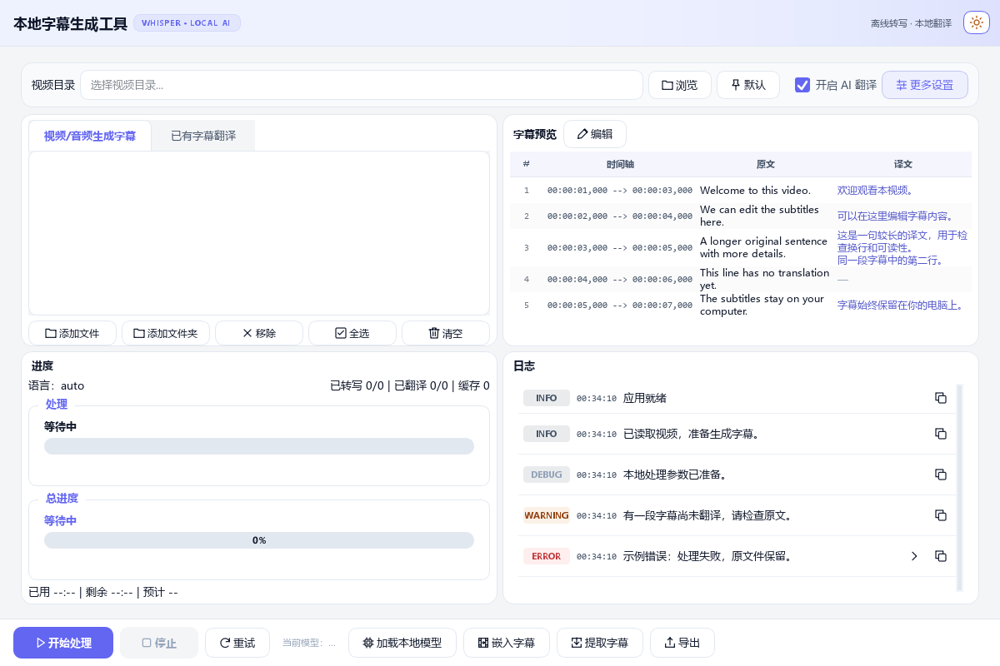
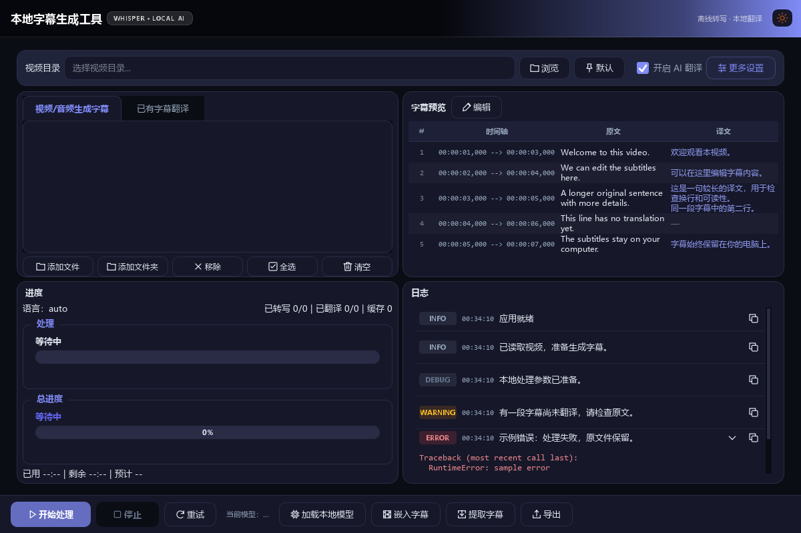
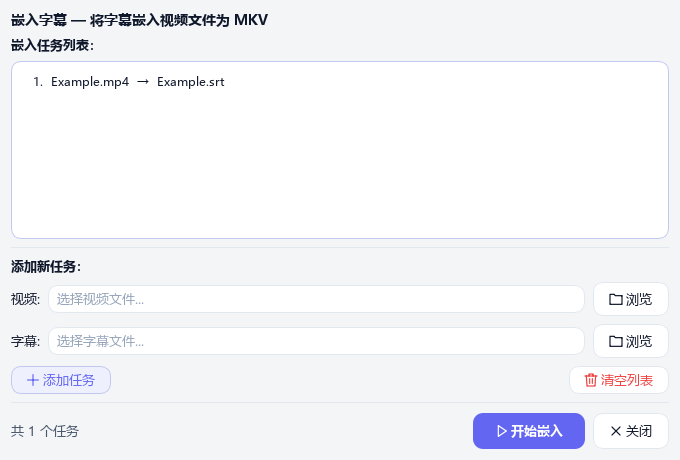
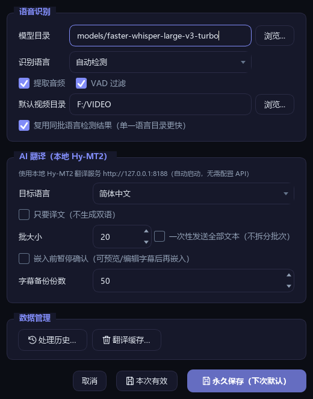

# 前端美化变更说明

记录日期：2026-10-04  
项目：本地字幕生成工具（Python / PySide6）  
状态：本地工作区已完成，尚未提交或发布

## 1. 改造目标与范围

本次调整围绕“保留各级页面的排版布局与功能，提高界面的统一性和阅读舒适度”展开，完成以下五项工作：

1. 统一操作按钮和文件类型的图标。
2. 减少按钮之间的颜色竞争，明确主次操作。
3. 调整字重，让标题、正文和辅助信息形成层级。
4. 统一设置、编辑、历史、缓存、嵌入和提取等弹窗的视觉细节。
5. 精修字幕表格与日志的文字、底色和状态提示。

“前端”在本文中指 PySide6 桌面界面，包括主窗口、弹窗、表格和自定义控件。整体方向是保留现有蓝紫主色与明暗主题，用统一的线性图标、柔和的状态底色和适度的字重，使操作更容易辨认。

本次没有调整页面分区、主窗口按钮顺序、弹窗的操作流程或处理参数。字幕转写、纯本地翻译、模型服务、媒体处理和文件保存策略也不属于此次美化范围。此前已经存在的浅色顶部修复、性能优化、翻译可靠性修复及其他文档修改，不计入本次五项变更。

## 2. 整体效果预览

### 2.1 主窗口：浅色主题

主要操作采用蓝紫主色，其他操作使用中性底色或浅色描边。表头与交替行保持低对比度，字幕原文、译文和时间轴各有侧重；普通日志标签使用灰色，警告与错误使用暖色。

### 2.2 主窗口：深色主题与异常详情

深色主题沿用相同的视觉规则。字幕译文使用带主色倾向的浅色文字，警告标签使用琥珀色，错误标签和异常详情使用红色系；异常详情仍可展开、收起。

### 2.3 嵌入字幕弹窗：浅色主题

标题、任务列表、输入框、分隔线和按钮统一继承主题。开始嵌入是主要操作，添加任务是次要操作，清空列表采用红色文字提示。

### 2.4 更多设置弹窗：深色主题

设置项仍按原有顺序呈现，说明文字降低强调；输入框、选项、滚动条和保存按钮跟随主题。

以上图片来自应用控件的离屏实际渲染，使用示例字幕、示例文件名和示例日志，不是概念设计图。主窗口截图采集于第 5 步完成后，弹窗截图采集于第 4 步完成后。截图环境注册了 Windows 中文字体并使用 Fusion 样式；系统窗口边框和真实显示器效果可能有所不同。

## 3. 第一步：统一图标

### 3.1 调整前的问题

按钮和文件列表原来主要把 emoji 或符号直接写在文字中，例如文件夹、保存、删除、播放和复制。这些字符来自不同字形，颜色、笔画粗细和基线位置不一致；不同系统字体和显示缩放下，外观也可能不同。

### 3.2 实际改动

- 新增统一的线性图标模块，使用同一组 SVG 路径和圆角笔画。
- 普通操作图标采用 24 × 24 的设计坐标，按钮通常以 16 × 16 的逻辑尺寸显示。
- 将已有按钮文案前的装饰字符转换为 Qt 图标，保留操作文案和原来的点击信号。
- 文件列表根据文件类型显示视频、音频或文件图标，文件名仍按原有规则展示。
- 字幕预览的空状态使用同一套视频图标，通过图片形式嵌入原有提示文字。
- 太阳、月亮主题按钮改用同一套可缩放图标；两者保留各自的琥珀色。
- 移除部分标题、说明和状态文字中的装饰 emoji，让标题依靠字号与字重表达层级。
- 为上一页、下一页、复制日志和展开详情等只有图标的按钮提供可访问名称；日志展开与收起时同步更新名称。

### 3.3 覆盖的图标类型

| 类别 | 代表操作或对象 | 新的表现方式 |
|---|---|---|
| 文件与目录 | 浏览、添加文件夹、视频、音频、字幕文件 | 文件夹、视频、音符、文件线性图标 |
| 处理操作 | 开始、停止、重试、加载本地模型 | 播放、停止、重试、芯片线性图标 |
| 字幕操作 | 编辑、保存、查找、时间偏移、嵌入、提取、导出 | 按操作语义区分的线性图标 |
| 列表管理 | 添加、移除、全选、清空、恢复、历史 | 加号、关闭、勾选、垃圾桶、恢复、历史图标 |
| 日志与导航 | 复制、上一页、下一页、展开或收起详情 | 复制与方向箭头图标 |
| 主题切换 | 浅色与深色主题指示 | 太阳与月亮线性图标 |

### 3.4 主题与缩放处理

图标通过自定义 `QIconEngine` 与 `QSvgRenderer` 绘制，而不是把固定大小的彩色 emoji 当作图片使用。一般按钮图标读取控件调色板中的文字颜色，禁用时使用禁用调色板，适应明暗主题与状态变化。渲染时保持正方形比例，减少窄按钮上的拉伸。

本次没有增加新的操作入口，也没有给每个纯文字按钮强行添加图标。部分源码仍保留原来的 emoji 前缀，按钮工厂会在生成控件时将其替换成图标，因此源码前缀不等于界面仍显示 emoji。

## 4. 第二步：明确按钮的主次关系

### 4.1 调整前后的对照

| 按钮类型 | 调整前 | 调整后 | 目的 |
|---|---|---|---|
| 开始、主要保存、确认 | 开始偏绿色，其他重要操作各自强调 | 统一使用蓝紫主色和白色文字，适度加粗 | 让主要操作更容易找到 |
| 更多设置、添加或恢复等次要强调操作 | 部分按钮使用实心强调色 | 主色文字、浅色底和描边 | 保留辨识度，减少与开始操作竞争 |
| 重试、浏览、导出、关闭等普通操作 | 字重较高，部分操作强调较多 | 使用中性卡片底色、边框和常规字重 | 降低工具按钮的视觉负担 |
| 历史删除、缓存清理、清空列表、移除选中 | 有些弹窗中采用实心红色按钮 | 红色文字，悬停时红色描边 | 提示清理含义，同时保持整体平衡 |
| 停止 | 红色操作按钮 | 启用时保留红色，禁用时降低对比度 | 保留停止操作的明确提示 |
| 禁用按钮 | 主要按钮可能仍有较强的实心色块 | 使用背景色和弱化文字 | 清楚表示当前不可操作 |

这里的“主要保存”包括设置页的永久保存、字幕编辑保存等。设置页“本次有效”仍是普通按钮；具体主次关系取决于原有页面操作，而不是所有包含“保存”含义的按钮都采用相同强调。

### 4.2 交互状态

主要按钮在悬停时略微加深；次要按钮在悬停时加强边框；普通按钮保留原有悬停与焦点反馈。深色主题中的主要按钮底色适度压暗，保持与周围界面的协调。

按钮的点击处理、取消行为、启用条件和参数传递保持原有实现。历史和缓存删除的确认流程保留，确认消息框原有的默认“否”选择也保留。美化没有扩大删除范围或增加自动执行行为。

## 5. 第三步：调整字体与字重层级

### 5.1 字重规则

过去多个按钮、复选框和标题同时使用较高字重，正文与操作之间的层级不够明确。现在一般内容使用常规字重，标题和主要操作保留适度强调。

| 元素 | 当前样式 | 说明 |
|---|---|---|
| 界面正文、普通按钮、复选框 | 常规字重 400 | 降低大面积加粗带来的拥挤感 |
| 主窗口应用标题 | 17 px、字重 700 | 保留应用名称的最高标题层级 |
| 面板标题 | 13 px、字重 600 | 比正文明确，但减少过度强调 |
| 弹窗主标题 | 14 px、字重 600 | 统一不同弹窗的标题强度 |
| 弹窗分节标题、选中页签、主要按钮 | 字重 600 | 标识当前区域或主要操作 |
| 弹窗提示文字 | 11 px、次要文字色 | 辅助说明不与输入项竞争 |

应用原有的中文字体顺序为 Microsoft YaHei UI、Microsoft YaHei、Segoe UI。本次沿用这一字体基础，没有引入需要额外安装的字体。

### 5.2 字体用途的区分

字幕原文、译文和日志正文改为沿用界面字体。字幕序号、时间轴、日志时间戳和异常堆栈保留 Consolas 等宽字体，让需要按字符定位的信息保持整齐。

界面样式中的 `px` 和通过 `QFont` 设置的 `pt` 是不同单位；本文分别记录实际设置，不将它们视为同一种尺寸。字体改变可能影响长文本的换行和自动行高，但不改变原文内容、列顺序或面板布局。

## 6. 第四步：统一各级弹窗细节

### 6.1 共用的视觉规则

此前部分弹窗各自设置颜色、提示文字和列表样式，切换主题后容易出现局部差异。本次将这些细节集中到主题样式表，并为标题、提示、统计信息和警告设置明确的控件样式名称。

- **标题与分节文字：**统一字号、字重，减少装饰字符。
- **说明与统计信息：**提示使用次要文字色；数量等信息使用统一的辅助文字样式。
- **警告：**未保存提示等使用主题危险色。
- **输入框：**占位文字使用弱化颜色，边框与焦点状态沿用主题规则。
- **列表：**统一交替行、悬停、焦点边框和选中状态；选中项采用柔和底色与正常文字色。
- **滚动条：**滑块颜色和悬停颜色随主题变化，减少各弹窗的硬编码颜色。
- **分隔线：**嵌入弹窗的分隔线使用主题边框色，并保留原有占位高度。
- **按钮：**嵌入、提取等弹窗移除重复的局部配色，继承共用的主次操作规则。

嵌入与提取弹窗仍保留原有紧凑列表字号、列表内边距和按钮尺寸规则；设置、历史及缓存弹窗也保留原有紧凑滚动条尺寸。样式集中化没有通过统一所有尺寸来重新排版。

### 6.2 页面覆盖表

| 页面或弹窗 | 本次变化 | 保留的操作与内容 |
|---|---|---|
| 更多设置 | 提示文字、普通选项字重、保存按钮层级、主题滚动条 | 模型目录、识别与翻译参数、会话应用、永久保存 |
| 字幕编辑 | 操作图标、未保存提示、普通与主要按钮层级 | 分页、查找、偏移、编辑、保存和取消 |
| 处理历史 | 历史图标、主题列表、删除与恢复按钮层级 | 已完成与已忽略记录的查看、删除和恢复 |
| 翻译缓存管理 | 数量与提示文字、主题列表、清理按钮样式 | 查看缓存、删除选中、清空缓存 |
| 嵌入字幕 | 主标题、分节标题、主题分隔线、输入框与按钮 | 添加视频和字幕配对、清空列表、开始嵌入 |
| 提取字幕 | 主标题、列表、说明与数量、按钮样式 | 添加文件、移除选中、提取字幕及原有转换选项 |
| 确认嵌入 | 操作图标和确认按钮层级 | 预览或修改字幕、确认嵌入、跳过嵌入 |
| 文本输入 | 确定按钮的主要操作样式 | 原有输入、确定和取消返回值 |
| 时间偏移输入 | 确定按钮的主要操作样式 | 原有数值范围、精度、默认值与返回值 |
| 标准消息框 | 继承主题和通用按钮字体样式 | 原有提示内容、按钮集合和默认选择 |

设置页“一次性发送全部文本”仍只控制批大小输入是否可用。本次去除了该输入框切换启用状态时残留的局部颜色覆盖，使禁用与恢复状态统一由主题样式负责。

## 7. 第五步：精修字幕表格与日志

### 7.1 字幕表格

| 元素 | 调整前 | 调整后 |
|---|---|---|
| 原文与译文字体 | Consolas，9 pt | 界面字体，9 pt |
| 序号与时间轴 | Consolas，8 pt，单独设置颜色 | 保留字体和尺寸，颜色从当前主题派生 |
| 原文颜色 | 按明暗模式单独指定 | 使用当前主题正文色 |
| 译文颜色 | 单独指定紫色或浅紫色 | 从主色与正文色混合得到，与界面主色协调 |
| 无译文的占位符 | 与译文同色 | 使用弱化文字色 |
| 表头底色 | 使用一般背景色 | 使用卡片色与少量主色混合的柔和底色 |
| 交替行、悬停和选中行 | 独立指定固定颜色 | 从当前主题卡片色、文字色和主色派生 |

序号和时间轴继续居中，字幕正文继续左对齐。“序号／时间轴／原文／译文”的列顺序和列宽分配规则保留。译文占位符仍只是展示层的破折号，不会写入字幕原文。

主题切换后仍刷新单元格前景色，避免旧主题文字色残留。定位高亮继续使用原来的黄色底色 `#fde68a` 和深色文字 `#1e293b`；它与普通选中状态不同，本次未更改其定位含义。

字幕原始内容、源文件关联、编辑行到字幕块的映射和保存流程保留。字体和底色变化不参与字幕解析、翻译或时间戳计算。

### 7.2 日志面板

日志条目仍按“等级标签 → 时间戳 → 正文 → 操作按钮”的顺序排列，异常详情放在原来的可折叠区域。

| 元素 | 当前表现 | 阅读作用 |
|---|---|---|
| INFO | 中性灰色底与次要文字色 | 普通信息保持清晰，减少色块干扰 |
| DEBUG | 中性灰色底，进一步弱化文字 | 调试信息低于普通信息的强调 |
| WARNING | 柔和琥珀色底，明暗主题分别使用合适的文字色 | 让需要关注的内容容易扫到 |
| ERROR | 柔和红色底与红色系文字 | 明确指出错误等级 |
| 时间戳 | Consolas 等宽字体、次要文字色、11 px | 保留时间定位信息，突出正文 |
| 正文 | 界面字体与主题正文色 | 提高中文和中英文混排的可读性 |
| 异常详情 | Consolas，9 pt，主题适配的错误色 | 保留技术信息的字符对齐 |
| 复制与详情按钮 | 小型线性图标，透明底，悬停时出现底色或边框 | 减少固定按钮色块占据注意力 |
| 条目分隔线 | 由卡片色与边框色混合得到 | 保留条目边界，降低线条强度 |

等级标签固定宽度仍为 56 个逻辑像素，复制和详情按钮仍为 24 × 20。未知等级仍按普通标签样式呈现，没有增加新的日志等级或筛选功能。

展示层继续把时间戳与正文分开，复制和导出仍使用保留的完整消息。存在异常详情时，复制内容仍包含消息与完整详情；展开和收起只改变详情的可见性与图标，不改变日志数据。

## 8. 代码与维护入口

| 文件 | 本次职责 | 主要入口 |
|---|---|---|
| [icons.py](../subtitle_app/icons.py) | 新增共用线性图标、按钮工厂和空状态图标转换 | `_LineIconEngine`、`make_icon`、`set_button_icon`、`action_button`、`icon_data_url` |
| [theme.py](../subtitle_app/theme.py) | 集中管理按钮层级、字体、弹窗、表格和日志样式 | `build_qss`、`make_sun_icon`、`make_moon_icon` |
| [qt_app.py](../subtitle_app/qt_app.py) | 主窗口按钮和文件列表使用共用图标，简化部分显示文案 | `_make_btn`、文件列表条目创建逻辑 |
| [panels.py](../subtitle_app/panels.py) | 字幕表格颜色与字体、预览空状态、编辑与输入弹窗样式接入 | `PreviewPanel._palette_colors`、`_style_item`、`EditDialog`、`_make_dialog_buttons` |
| [widgets.py](../subtitle_app/widgets.py) | 日志条目的主题样式名称、字体和图标 | `LogEntry`、`LogEntry._toggle` |
| [dialogs.py](../subtitle_app/dialogs.py) | 各弹窗接入共用图标和主题规则，保留紧凑尺寸 | `SettingsDialog`、`EmbedDialog`、`ExtractDialog`、历史与缓存等弹窗函数 |
| [CHANGELOG.md](../CHANGELOG.md) | 记录五项美化的未发布变更 | “界面美化（2026-10-04）” |

维护时优先在 `theme.py` 调整共用颜色、字体和状态规则；新增图标优先沿用 `icons.py` 的笔画风格。弹窗的局部样式目前主要用于保留尺寸，避免重新加入会覆盖明暗主题的固定文字色或背景色。

这些是现有界面的视觉实现约定。本次没有新增主题设置项、引入外部图标服务或安装额外的图标字体包。

## 9. 已完成的验证与结果

以下结果来自本次美化实施期间的代码检查、渲染记录和回归测试。测试数据使用模拟模型服务、临时历史或缓存目录、示例字幕与日志，未处理用户实际媒体。

| 验证项目 | 方法与结果 | 验证范围 |
|---|---|---|
| 完整回归测试 | 最后一次应用样式修改后运行完整 unittest：188 项通过，用时 8.459 秒 | 当前项目自动化回归覆盖的行为 |
| 定向回归测试 | 表格和日志相关的控件、缺陷回归测试共 19 项通过 | 相关既有行为 |
| 主窗口主题切换 | 离屏实际渲染浅色 → 深色 → 浅色 | 文字、图标、表格和日志的主题状态 |
| 第 5 步布局对照 | 在 1200 × 800 测试窗口下比较前后报告 | 已记录的四个主要区域矩形、窗口尺寸和表格列宽一致 |
| 字幕内容与编辑 | 比较主题切换前后的原始文本，修改示例译文并检查回写 | 原文保持、编辑映射及定位高亮 |
| 日志行为 | 检查完整日志导出，模拟剪贴板检查复制文本，展开并收起异常详情 | 导出、复制、详情折叠 |
| 弹窗主题覆盖 | 第 4 步渲染 10 类弹窗的明暗主题，共 20 个组合 | 本文页面覆盖表中的弹窗类型 |
| 第 4 步弹窗几何对照 | 比较窗口尺寸、最小尺寸及记录的标签、按钮、列表和框架矩形 | 对照记录一致，控件顺序与文案一致 |
| 弹窗原有行为 | 检查设置值、输入返回值、禁用联动、配对数据及消息框默认按钮 | 被检查的交互保持原有含义 |
| 图标缩放 | 第 1 步检查 100%、150%、200% 下图标的渲染尺寸与设备像素比 | 图标渲染；不代表所有页面完成所有缩放组合验收 |
| 静态检查 | `python -m compileall -q subtitle_app` 与 `git diff --check` 通过 | Python 编译和差异空白格式 |

第 5 步测试样例的四列表格宽度在两种主题下均保持为 40、185、165、164 个逻辑像素。普通字幕行保持 31 个逻辑像素高；一条较长的多行字幕从 48 调整为 45，这是字体变化后原有自动行高机制的结果，不是固定行高或页面布局调整。

### 9.1 验证边界

- 截图验证使用离屏 Qt 控件渲染，可以检查实际样式和控件几何，但不覆盖 Windows 原生窗口边框、每台显示器的色彩或所有系统缩放组合。
- 回归测试和示例交互验证没有重新运行真实语音模型、翻译模型或完整媒体流水线；本次不据此声称转写、翻译或媒体处理速度提高。
- 文档中的截图展示代表性状态，不能替代所有数据长度、窗口尺寸和字体环境下的实机检查。
- 新增图片随本文保存于 `docs/images/frontend-2026-10-04/`，避免依赖个人机器上的临时截图路径。

## 10. 查看与验收建议

重启应用后，可以按以下顺序检查日常使用效果：

1. 在常用窗口尺寸下切换浅色与深色主题，观察主操作、普通按钮和禁用按钮是否容易区分。
2. 导入一份包含中英文和多行译文的实际字幕，检查表格换行、选中状态和编辑保存。
3. 打开更多设置、字幕编辑、历史、缓存、嵌入和提取弹窗，确认提示文字、选中项和按钮样式一致。
4. 在实际使用中检查较长日志的换行，并检查复制、导出及异常详情展开收起。

后续若发现字号偏小、特定缩放下的裁切或局部颜色不合适，优先围绕实际截图调整字体、边距或主题颜色，再复核对应页面的布局和交互。
